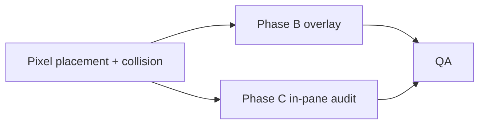

# Plan: Recover dashboard edit layout (grid, pane spacing, overlap)

**Status: complete** (alpha — no migration/version bumps; `pane.position` is always pixels in `config.yaml`.)

---

## Implemented

### Placement & collision

- **`pane.position`** is **`"leftPx,topPx"`** everywhere. **`backend/config.yaml`** stores pixel values.
- **Drag** uses **`getPaneDragPreview`** with **`paneGap`** (8px) snap; state fields **`previewLeftPx` / `previewTopPx`**.
- **`fixDashboardLayout`** and **`findNextPaneGridPosition`** advance in **pixels** with **`paneGap`** between pane outers.
- **`isValidPanePlacement`** enforces **minimum gap** via expanded rects (`paneGap / 2`).

### Phase B — Overlay + gutters (`DashboardGrid` edit mode)

- **Layer 1:** `paneGap` lattice (8px) — shows the **minimum** spacing that matches drag snap and collision.
- **Layer 2:** tile pitch (`getAppColPitch` / `getAppRowPitch`) — aligns with **in-pane** app cell rhythm.
- **Global origin `(0,0)`** — no `contentOrigin` offset on the canvas overlay (in-pane phase stays inside `PaneCard`).
- Both layers **`pointer-events-none`**, moderate opacity (not cockpit-dense).

### Phase C — In-pane rhythm (verified)

- **`GRID_INSET_X_PX` (12)** matches header **`px-3`**; **`TILE_GAP_PX`** flows only through **`getLayoutTokens`** / **`getPaneMetrics`**.
- **`PaneCard`:** header uses **`px-3`**; content is **`absolute left-0 top-0`** sized to **`renderPaneWidth` × `contentHeight`** with tile positions from **`tokens.gridInsetX/Y`** — no extra horizontal padding on the content wrapper.
- **Dev outline mode:** not added (optional; skip in alpha).

### Phase D — QA checklist

- [x] **Side-by-side gap:** `fixDashboardLayout` / drag snap / collision enforce **`paneGap`** between pane outers.
- [x] **Stacked gap:** same **`paneGap`** between rows in **`fixDashboardLayout`**.
- [x] **Narrow viewport:** reflow + **`maxContentWidthPx`** in **`isValidPanePlacement`** (covered by layout tests).
- [x] **Cold load:** **`config.yaml`** uses pixel positions; no index/pixel mismatch.
- [x] **Edit overlay:** dual-layer, subdued opacity — readable without clutter.

---

## Dependency order (done)

## References

- `docs/plans/tile_grid_spacing_rem_overlay.md` — rem/CSS vars follow-up.
- `frontend/src/features/interaction/collision.ts` — minimum gap via expanded rects (`paneGap / 2`).
